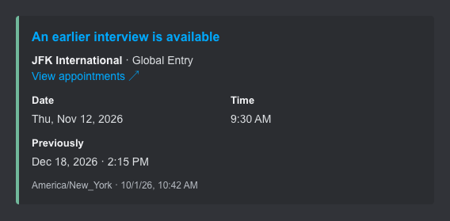
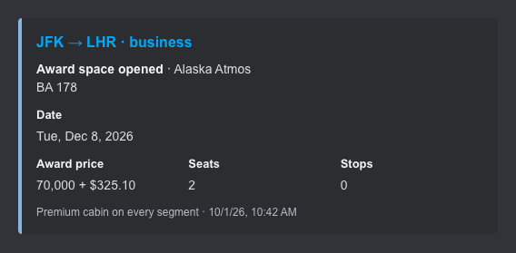
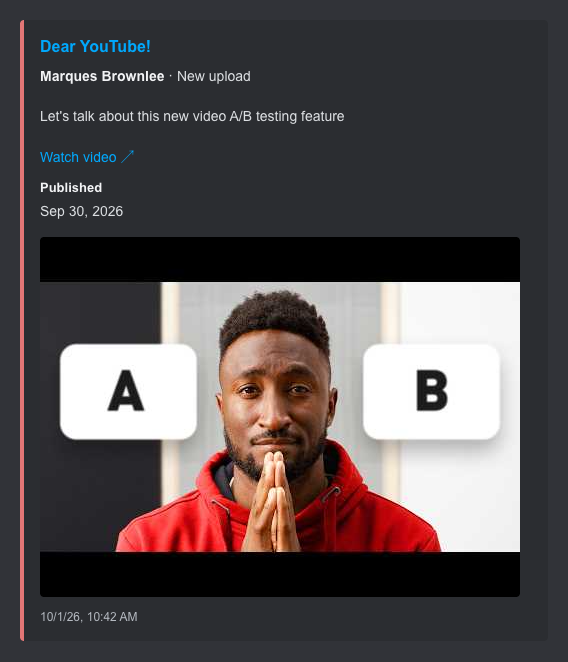

# monitors

Drops, deals, openings, and updates. Built with [monitord](https://github.com/saucesteals/monitord).

## Using an agent

Share this collection with your agent, tell it what to watch, and choose where alerts should go. Your agent can read the monitor’s README, customize its configuration, and run it with [monitord](https://github.com/saucesteals/monitord).

## Shopping

- **[Limited drops](monitors/commerce/shopify/README.md)** — Collabs, your size, restocks, price drops. · [code](monitors/commerce/shopify/source.go)
- **[Marketplace](monitors/commerce/marketplace/README.md)** — Local finds by query, radius, and budget. · [code](monitors/commerce/marketplace/source.go)
- **[Amazon](monitors/commerce/amazon/README.md)** — Seller + shipper + price rules. · [code](monitors/commerce/amazon/source.go)

## Travel & dining

- **[Global Entry](monitors/travel/global-entry/README.md)** — Earlier interviews before your deadline. · [code](monitors/travel/global-entry/source.go)
- **[Award seats](monitors/travel/award-seats/README.md)** — Premium cabins, enough seats, fewer points. · [code](monitors/travel/award-seats/source.go)
- **[Reservations](monitors/dining/tablecheck/README.md)** — Your restaurant, party, and exact seating. · [code](monitors/dining/tablecheck/source.go)

## Feeds & updates

- **[GitHub](monitors/development/github-releases/README.md)** — Releases, prereleases, tag filters. · [code](monitors/development/github-releases/source.go)
- **[YouTube](monitors/media/youtube/README.md)** — Uploads from channels you follow. · [code](monitors/media/youtube/source.go)
- **[RSS & Atom](monitors/media/rss/README.md)** — Articles with title and category filters. · [code](monitors/media/rss/source.go)
- **[Statuspage](monitors/infrastructure/statuspage/README.md)** — Component incidents and resolutions. · [code](monitors/infrastructure/statuspage/source.go)
